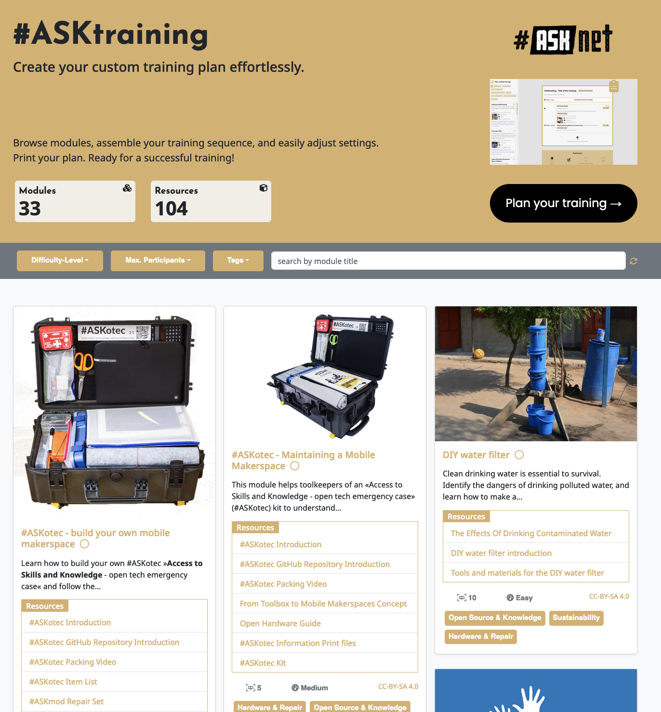

# Module Overview Page

+ Gain a comprehensive understanding of each module and its resources.
+ Learn how to efficiently navigate through modules using filters and the search bar.
+ Explore the functionality of the training planner and how to automatically add selected modules to your training plan.

 <em>The Module Overview Page</em>

## Understanding module boxes
__Each module focuses on a specific topic with related resources.__

Additional information every Module provides:
+ Max Participants
+ Difficulty Level
+ License

<video width="600" <source src="images/module_overview_page/module-topic_additional_info.mp4"></source></video>
 <em>Module Box with informations</em>

<video width="600" <source src="https://github.com/walthierer/webinar_1-ASKtraining/blob/main/images/module_overview_page/module-topic_additional_info.mov"></source></video>
 <em>Module Box with informations link</em>

<video src="https://github.com/walthierer/webinar_1-ASKtraining/blob/main/images/module_overview_page/module-topic_additional_info.mov" width=600></video>

<video src="images/module_overview_page/module-topic_additional_info.mov" width=300></video>

## test
